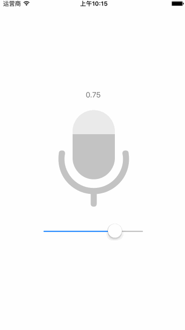

#MaskProgressView
MaskProgressView is a custom progress view which can be masked with an image containing an alpha channel.



##How To Get Started
###Carthage
Specify "MaskProgressView" in your ```Cartfile```:
```ogdl 
github "teambition/MaskProgressView"
```

###Usage
```swift
progressView.direction = .vertical
progressView.maskImage = UIImage(named: "exampleIcon")
progressView.frontColor = UIColor(white: 195 / 255, alpha: 1)
progressView.backColor = UIColor(white: 235 / 255, alpha: 1)
progressView.animationDuration = 0.5
progressView.setProgress(0.35, animated: true)
print(progressView.progress)
```

## Minimum Requirement
iOS 8.0

## Release Notes
* [Release Notes](https://github.com/teambition/MaskProgressView/releases)

## License
MaskProgressView is released under the MIT license. See [LICENSE](https://github.com/teambition/MaskProgressView/blob/master/LICENSE.md) for details.

## More Info
Have a question? Please [open an issue](https://github.com/teambition/MaskProgressView/issues/new)!
